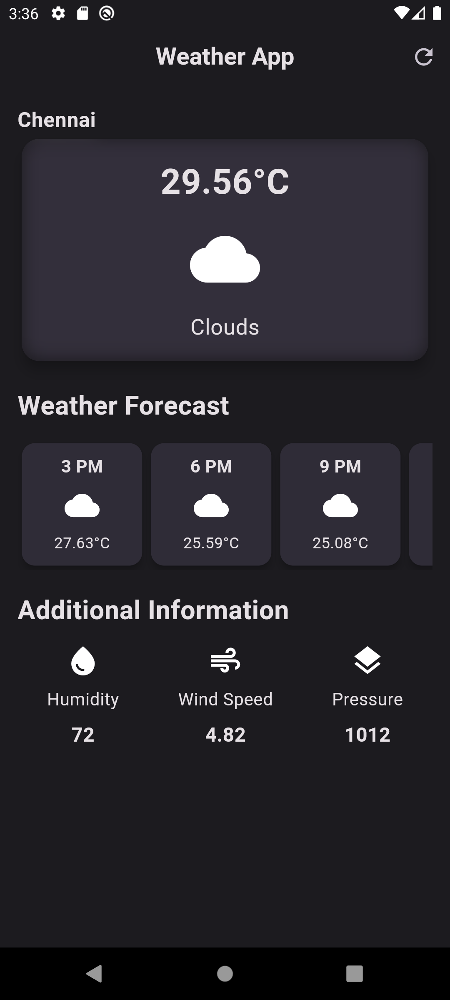

# Weather App Made with Flutter

A weather app that provides current weather information, hourly forecast, and additional details.

## Features

- Display current weather conditions, including temperature, weather icon, and description.
- Hourly forecast for the upcoming hours.
- Additional information such as humidity, wind speed, and pressure.
- Dark mode support.

## Acknowledgments

- Weather data provided by [OpenWeather](https://openweathermap.org/).

## Screenshots

Enjoy building with Flutter and stay tuned for more updates!
